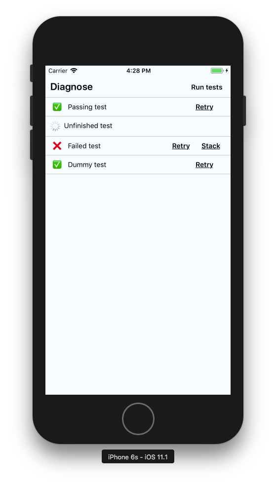

# react-native-diagnose


A react runtime diagnose component

## Rationale
* Testing native applications is complicated
* There are features that can only be tested on a device, unless mocked
* You may want to test your app on a production build, before submit it to the stores

```javascript
import { Diagnose, Test } from 'react-diagnose'

/**
 * Diagnose will run all test components inside
 * Test components are going to be marked visually as completed or not
 * to d
 */
return (
  <Diagnose suiteTitle="Diagnose">
    <Test should="Passing test" />
    <Test should="Unfinished test" run={() => {
      return new Promise(() => setTimeout(() => {}, 1000000))
    }} />
    <Test should="Failed test" run={() => {throw new Error('Failing test')}} />
    <Test should="Dummy test" />
  </Diagnose>
)
```



## Help wanted
- [ ] Elapsed time
- [ ] Before all
- [ ] Before each
- [ ] After each
- [ ] After all


More documentation is incoming, in the meanwhile please read the source code. It is a single file!
PRs and issues are more than welcome.

<a href="https://getyeti.co" target="_blank">
  
</a>

> This package powers [Yeti Smart Home](https://getyeti.co) and is used in production.

Follow us in Github or https://twitter.com/netbeast_co.
